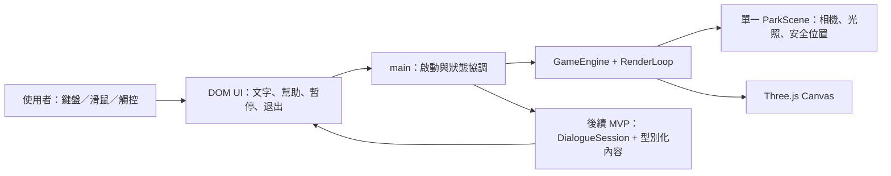
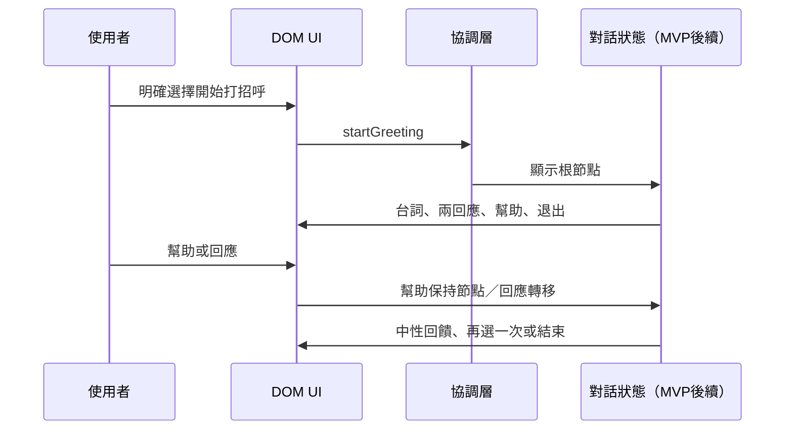
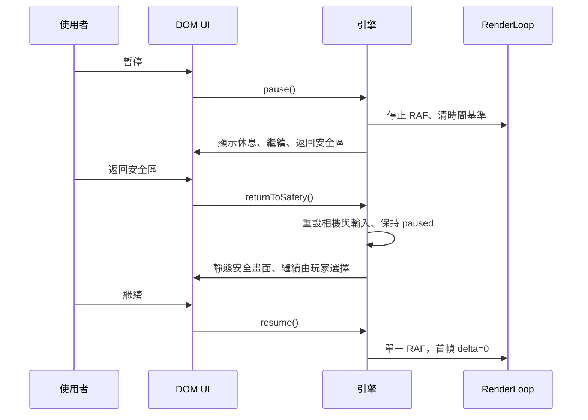

# S1 現有工具分析與架構

日期：2026-10-07。狀態：S1 文件整理完成；未實作、未執行遊戲或專業審查。

## 1. 盤點與判讀原則

專案路徑：`C:/Users/fresh/projects/Social-interactive-game`。初始含兩份 Markdown 設計文件；無實體 AGENTS.md、STATE.md、README、package.json、原始碼、assets、migrations、測試或 CI。Git 指令回報非倉庫，不能確認未提交狀態；本次保留所有原始文件，僅新增本文件與 STATE.md。

已讀可用規範：`C:/Users/fresh/.agents/skills/dev-flow/SKILL.md`、`C:/Users/fresh/.agents/skills/s1-arch/SKILL.md`、`C:/Users/fresh/.agents/skills/dev-flow/CONVENTIONS.md`。指定 `.Codex/skills/dev-flow` 不存在。採用使用者訊息中的 AGENTS 指示。使用者要求精簡 S1，故縮小 skill 的商業／開源競品數量要求，不擴增技術棧。

下文「路線圖」指 `Claude 實作路線圖.md`，「藍圖」指 `Three.js ASD 社交小遊戲完整架構藍圖.md`。章節與行號均指本次保留的原始檔。所有介面、程式範例、安裝指令與版本只作參考，沒有編譯、安裝或 API 相容性保證。

證據分三類：**文件要求**＝原始文件內容；**建議／合理預設**＝本次分析，尚未由使用者確認；**使用者已確認**＝本次只做文件、指定評估起點、第一工程里程碑及停止邊界。使用者提出的 MVP 是待細化的建議範圍，不冒充已完成實作。

## 2. 需求摘要

### 兩份文件一致的需求

| 需求 | 來源章節 | 本次收斂 |
|---|---|---|
| 社交情境練習、非診斷／治療，不宣稱療效 | 路線圖角色設定／結尾；藍圖 §1.1、§12.2 | 保留定位；專業內容審查另列待辦 |
| 低刺激、可預測、無懲罰／排名／強制限時 | 路線圖全域約束；藍圖 §1.2、§2.2、§8.5 | 列為 MVP 不變條件 |
| NPC 不主動靠近；可不互動、退出、重試 | 路線圖 Phase 3–4；藍圖 §1.3、§8.1 | 靜止 NPC，使用者明確啟動對話 |
| Three.js + TS + Vite、DOM overlay，桌面／平板 | 路線圖 Phase 0–2；藍圖 §10.1、§10.4 | 不額外引入 UI 框架 |
| 可讀文字、幫助／重播、降低動態、可配置 | 路線圖 Phase 4、6；藍圖 §2.3、§8.5 | 基本支持前移；完整控制台延後 |
| 進度本地優先、可清除／匯出、照護者支持 | 路線圖 Phase 8；藍圖 §11–12 | 屬後續範圍，MVP 不記錄兒童歷史 |

### 需求分層

- 第一個可玩 MVP 必要：一個公園與安全區、一位 NPC、一段打招呼、兩種回應與幫助／退出、可達的重試路徑、隨時暫停及返回安全區、桌面／觸控支持、基本可讀性與降低動態。
- 後續擴充：完整街坊、多場景、多 NPC 排程、完整照護者控制台、進度追蹤／匯出／清除、呼吸訓練、情緒自評／反思、多語系、資源壓縮、自動畫質調整。
- 待使用者決定：年齡與陪同、主要導覽方式、語音必要性。詳見 §10，最多三題。

## 3. 規格衝突與處理建議

以下均為建議，沒有改寫原始需求或把例子當成已驗證實作。

| ID／來源章節與行號 | 問題 | 建議處理 | 影響 |
|---|---|---|---|
| C1 路線圖全域約束 L31、Phase 6 L534、Phase 9 L684；藍圖 §2.3 L92、§7.1–7.2 | 上限 0.6，設定卻到 0.7；內容又要求 ≤0.45 | HSL S 絕對上限 0.6；環境採 0.15–0.35、互動 0.30–0.45。MVP 用固定色盤；未來設定限制／校驗到 0.6 | 不容許設定繞過安全界線；色彩處理後需檢查實際畫面 |
| C2 路線圖全域約束／Phase 6 L536–537；藍圖 §2.3、§7.2 | 禁 blur／shake，卻有可開啟 boolean | MVP 不提供開關且不實作；未來兼容舊資料時忽略 true，固定禁用 | 減少刺激與設定歧義 |
| C3 路線圖全域約束／Phase 3 L368；藍圖 §8.2 L914、§8.6 L1226 | maxInteractionTime=180 看似強制逾時；藍圖實際只 offerBreak | 移除 MVP 計時器；後續如需提醒改名 breakReminderAfterSeconds，可選、非阻擋、不自動結束；暫停不計時 | 保障慢速回應；不將「3 分鐘」當限制 |
| C4 路線圖全域約束 L53、Phase 1 L236／契約 L831；藍圖 §4.3、§6.4、§10.2–10.3 | 禁 any 但泛型、設定、cache、navigator 使用 any | 事件採具體 event map；設定用 K extends keyof Settings + Settings[K]；外部資料用 unknown + 縮窄。第三方例外須局限邊界並註明 | strict 與 lint 必須真正檢出；例子不能直接移植 |
| C5 藍圖 §2.2、§7.1、§10.6–10.7；路線圖色彩快速參考／Phase 6 | 環境低對比被延伸到 UI；文字飽和度表與 uiText 例子不一致；透明預覽降低可讀性 | 環境柔和，DOM 使用不透明淺底深字；文字以對比為準，勿受環境曝光／降飽和影響。一般文字 ≥4.5:1，大字 ≥3:1，必要控件／焦點 ≥3:1；實際組合再量測 | 不等於宣稱 WCAG 合規；詳見官方依據 §4 |
| C6 藍圖 §1.3／§13；路線圖 Phase 0 L208、Phase 1、Phase 6、Phase 9–10 | 退出 HTML 已有，但安全區內容／完整 UI 太晚，ESC 暫停也未定完整行為 | Phase 0–1 即提供常駐暫停、返回安全區和 DOM 休息畫面；初始化前／失败也能結束本次 | 安全為首個驗收門檻，不能等 Phase 9 |
| C7 藍圖附錄 A；路線圖建構指令 L861、864 | howler.js 與 npm howler；gltf-pipeline 與 three-gltf-pipeline 不一致 | 音訊後續採官方 npm 名 howler；離線資產工具參照 CesiumGS 的 gltf-pipeline，不能假定名稱可互換。骨架均不需要 | 無安裝；S2 核對套件／型別／授權和資產管線 |
| C8 藍圖 §11.2 L2337；路線圖 Phase 8 | tx.done／Promise get 是 idb 封裝 API，例子未交代 openDB 回傳型別 | 後續明確選 idb 的 openDB 與型別契約；不可混用原生 IDBRequest。MVP 不做儲存模組 | 防止假 async 與完成事件誤判 |
| C9 藍圖 §8.3–8.5；路線圖 Phase 4 L450–460 | 入門 2 選項卻要求另含幫助；路線圖 JSON 只有回應＋幫助；repair 節點不可達且被標成結尾 | 兩個回應按鈕，另有幫助／退出；幫助不消耗回應。修復／重選必須有返回根節點的連線；terminal 可少於兩回應 | 驗收以可達路徑為準，非節點數量 |
| C10 藍圖 §8.4／§8.5、§10.5；路線圖 Phase 4 | 「所有正向結尾」與 neutral 類型衝突；exitDialogue 呼叫 complete，將退出算完成 | 正向解釋為不羞辱、不懲罰，允許中性退出。結果分 finished／skipped／exited；無完成統計。語言／點頭皆有效，修復不代表點頭錯誤 | 尊重不同溝通方式，不強迫眼神接觸或迎合 |
| C11 路線圖全域約束／Phase 2；藍圖 §7.2、§10.4 | 閃爍禁止門檻 1Hz／3Hz 不同；head bob 一處禁止、一處可開；每幀 new 與禁 new 衝突 | MVP 無閃爍／脈動／head bob；重用數學暫存物件，使用與 delta 相關的平滑，不盲套固定 slerp 因子 | 不聲稱特定頻率對每人安全；降低動態不只放慢時間 |
| C12 路線圖 Phase 1；藍圖 §10.3、§10.5 | pause 只略過 update；對話 setTimeout 仍可能前進，恢復可能累計大 delta | 管理單一 RAF 與模擬時鐘；暫停凍結模擬／對話，DOM 獨立；恢復第一幀 delta=0；退出取消未完成回呼 | 必須生命週期測試，保留原對話位置 |
| C13 藍圖 §8.2／§8.6、§10.2、§10.6；路線圖 Phase 1 | proximityStopDistance 位於 behavior 但讀 safety；near 分支提早 return 可跳過提示；debug extension 誤呼叫 getParameter；UI settings／欄位未完整定義；ACESToneMapping 名稱疑誤 | S2 核對對應版正式 API／型別，S4 僅實作縮小契約；不以裝置猜測替代量測，不照搬偽完整類別 | 原始例子不具可運行保證 |
| C14 藍圖 §12.1／§9.1；路線圖隱私約束 | 藍圖允許同意後生物資料／遠端分析，路線圖全面禁止 | 本次採較窄範圍：無生物／攝影機／定位／第三方分析，無遠端服務；後續如提議需另定需求與同意 | 不增加隱私架構或帳號 |
| C15 藍圖 §6.1／§13.3、附錄 B；路線圖 Phase 7／角色設定 | FPS 30／60、VRAM／貼圖與總記憶體混淆；18 週沒有估算條件 | 桌面 60、入門平板 30 作未驗證目標；分開指標，實機才結論；時程不當承諾 | 見 §8 測量條件，S2 定裝置矩陣 |

## 4. 現有工具比較與 Build／Buy／Fork

這是針對單情境的精簡評估，不聲稱已完成商業產品全面盤點或找到可直接使用且已審查的 ASD 內容套件。外部查證日期 2026-10-07；版本號與完整相容性留 S2。

| 名稱／類型 | 能提供／優點 | 不足與代價（本次判斷） | 授權／整合與結論 | 官方來源 |
|---|---|---|---|---|
| Vite + vanilla-ts／建構工具 | 官方提供無框架 TS 模板，產出靜態資產 | TS 轉譯不等於型別檢查，需另跑 tsc；非遊戲引擎 | 套件與傳遞授權 S2 記錄；建議使用 | [Vite Guide](https://vite.dev/guide/)、[TS 功能說明](https://vite.dev/guide/features.html#typescript) |
| Three.js／渲染函式庫 | 提供 3D 場景、相機與渲染構件 | 生命週期、輸入、對話及 DOM 無障礙需自己整理 | MIT，保留授權；採庫，不 fork 整個 repo | [官方 Manual](https://threejs.org/manual/)、[LICENSE](https://github.com/mrdoob/three.js/blob/dev/LICENSE) |
| Babylon.js／整合引擎替代 | 官方列出場景、相機、GUI、資產等較完整功能 | 換引擎與新抽象代價；不替代社交內容與 DOM 可讀性工作 | Apache-2.0；目前不採用，S2 如有致命阻礙才重評 | [功能](https://www.babylonjs.com/specifications/)、[授權](https://github.com/BabylonJS/Babylon.js/blob/master/license.md) |
| HTML/CSS 原生 UI／既有瀏覽器能力 | 真實 button、焦點、文字縮放；適合兩選項與暫停 | 需自行管理版面配置、焦點回復與狀態 | 無新增 runtime 套件；建議自建小 UI | [W3C WCAG 2.2 Quickref](https://www.w3.org/WAI/WCAG22/quickref/) |
| Howler、idb／後續函式庫 | 音訊統一介面；IndexedDB Promise 封裝 | 目前骨架無音訊與持久資料需求 | 官方 repo 均 MIT；延後，勿預裝 | [Howler](https://github.com/goldfire/howler.js)、[idb](https://github.com/jakearchibald/idb) |
| gltf-pipeline／離線工具 | glTF 資產最佳化 | 非瀏覽器遊戲 runtime；幾何骨架不需要 | Apache-2.0；只在引入模型時評估 | [官方 repo](https://github.com/CesiumGS/gltf-pipeline) |

Build／Buy／Fork：渲染與建構用現成函式庫；自主參與規則、單情境對話和 DOM UI 自建。無已確認 SaaS 需求，不 Buy；無適配內容與授權證據，不 Fork。React／Tailwind／狀態庫不因共用預設加入。日後若出現跨頁大型控制台才重估 React；多裝置同步才需服務與身份系統；代價包含維護、隱私和部署，不是目前需求。AI 對話有不可預測內容與審查成本，本次不加入。

WCAG 僅作 UI 工程依據：1.4.3 文字對比、1.4.11 非文字對比、1.4.4 文字縮放、2.1.1 鍵盤、2.4.7/2.4.11 焦點、2.5.8 目標尺寸；建議觸控採至少 44×44 CSS px（較最低標準更寬裕），不是已驗證合規。這些標準不證明 ASD 適用性或療效；S3 仍須個別內容與使用者需求考察。

## 5. 精簡架構、技術棧與資料模型

建議 Vite + strict TypeScript + Three.js；HTML/CSS overlay；單場景、直接型別化回呼。小型狀態機即可，不預建全域 EventBus、SceneManager、BaseScene、Factory 或大量空資料夾。拆分依實際責任成長。



全部在瀏覽器；沒有 backend／DB／外部 runtime 服務。MVP 僅記憶體存狀態，重載重置；安全偏好每次給保守預設，未來有明確需求才加入本地偏好保存，與兒童進度分離。

資料草稿（設計契約，未實作）：EngineState=`new | initializing | ready | running | paused | error | disposed`；單一 ParkScene 持有安全相機姿態。MVP 加 Scenario（id、npcId、rootNodeId、nodes）、Node（text、兩個 Response 或終端、helpText）、Response（id、text、nextNodeId）；Scenario 1:N Node，Response 引用同情境 Node。DialogueSession 存當前 nodeId、暫停前位置及 finished/skipped/exited 結果。所有引用需可達性檢查；MVP 不採人格推測、情緒評分或歷史資料庫。

### 主要資料流





## 6. 第一個可玩 MVP

進入簡單公園的安全位置，先看到「可以先看看，也可以打招呼」。一位 NPC 固定在可預期位置，不巡邏、不追人，距離不會迫使玩家接近。使用者按下明確互動按鈕才開始，沒有自動彈出對話。

一個打招呼情境：NPC「你好」。回應 A「你好！」、B「點頭打招呼」；兩者得到平等、具體且不評分的回饋。另有「幫助」（示範與簡短文字，保留原節點）、「返回安全區」（退出）與「先不參與」。回饋提供「再選一次」返回根節點；修復例為「我想換一種說法」→「可以慢慢來」→根節點，不創造羞辱／錯誤答案。離開後可再次開始；無倒數、強制冷卻、眼神接觸要求或自動往下一句。

基本支持：文字一次完整顯示、可再看台詞、圖示附文字、字體調整、明顯鍵盤焦點、UI 不以顏色唯一傳意。暫停、返回安全區在所有操作狀態可用；暫停保留對話，返回安全區取消對話與待執行工作。降低動態預設保守並參考 prefers-reduced-motion，關閉裝飾／head bob，不以整個 timeScale 變慢取代設計。

| 平台 | 操作建議 | 支持與待驗證 |
|---|---|---|
| 桌面 | WASD／方向鍵移動、滑鼠拖曳視角；明確按鈕／Enter 互動；ESC 暫停 | Pointer lock 僅主動選擇，退出釋放；UI 聚焦時不攔鍵盤。提供按鈕式導覽備援 |
| 平板 | 大型移動按鈕或固定站點導覽、拖曳看向；點按選項與暫停 | 不要求同時雙指操作；處理 pointercancel、橫直屏與安全邊距，不讓操控區擋對話 |

主導覽方式仍待 Q2。自由移動如採用，須限制邊界、速度／靈敏度並允許靜止互動。桌面與平板操作均未實測。

後續不包含於首個可玩 MVP：完整街坊、多 NPC 排程、多場景、完整照護者控制台、資料匯出、呼吸訓練、情緒紀錄／進步曲線、多語系、大量模型與後處理。無廣告、外連誘導、多人社交、登入、雲端 DB、AI 對話或分析追蹤。

## 7. S4 第一工程里程碑：Phase 0 + Phase 1 最小可運行骨架

**本節只規劃。骨架不等於上述可玩 MVP**：先驗證場景、生命週期與安全 UI，尚無 NPC、對話或移動系統。Phase 0 為工具設定；Phase 1 為單場景與引擎。安全控制／可讀性提前，沒有完整場景切換管理器也能驗收。

### 必要檔案、責任與介面

| 預計檔案 | 責任／設計契約 |
|---|---|
| index.html、src/styles.css | zh-TW、canvas + DOM 容器；常駐暫停／安全按鈕，不依賴 WebGL 成功才能出現 |
| src/main.ts | 驗證 DOM、先掛安全 UI、建立引擎、錯誤提示、重試時銷毀舊實例；接 pagehide／visibilitychange |
| src/core/GameEngine.ts | init(canvas): Promise<void>、start/pause/resume/returnToSafety/resize/dispose；擁有 renderer、scene、loop，提供狀態回呼 |
| src/core/RenderLoop.ts | start(frame)、stop；單一 RAF id、秒單位 delta、模擬 elapsed；可注入 scheduler 以測生命週期 |
| src/scene/ParkScene.ts | 建立地面／安全標記、PerspectiveCamera、環境與半球光；resetToSafety、resize、dispose；回傳 scene/camera，不做多場景抽象 |
| src/ui/SafetyUI.ts | attach(actions)、render(state)、showError、dispose；真實 DOM button、焦點回復、休息畫面；不受 RAF 控制 |
| package.json、鎖檔、tsconfig.json、必要 Vite／ESLint 設定、格式設定 | S2 確定後於 S4 建立；strict、明確 scripts、型別與 lint 工具相容 |
| tests/core/RenderLoop.test.ts、tests/core/GameEngine.test.ts | 必要狀態／資源測試，注入 RAF 與 renderer 邊界，不大量鏡像實作 |

不預建 audio、NPC、資料庫、EventBus 或 loader 空殼；後續可玩 MVP 才增 PlayerInput、DialogueSession、greeting 內容與 DialogueUI。

### 生命週期與安全契約

1. `new → initializing → ready → running`。init 成功前不可 start；重複 start／resume 不重複 RAF。初始化中重複呼叫需被拒絕或共用同一 Promise，策略實作時固定並測試。
2. init 對 WebGL／DOM／場景錯誤採具型別結果或 catch unknown 縮窄；部分成功資源仍須清理。顯示「目前無法顯示場景，可以重試或結束本次練習」，技術診斷只到 console。重試不得留下重複 canvas／listener／RAF。
3. pause：立即停止模擬、清輸入、退出 pointer lock（後續如有）、停止 RAF。DOM 按鈕與焦點仍有效；需可見靜态 canvas 時保留上一幀，尺寸變更可單次 render，不更新模擬。
4. resume：只允許 paused → running，重設時間基準；第一幀 delta=0，其後建議 clamp delta ≤0.05 秒，elapsed 不含暫停。長時間失焦不補跑；visibilitychange hidden 轉 paused，回來需玩家按繼續。
5. returnToSafety：running／paused 立即重設安全相機姿態與輸入，單次繪製後保持 paused，DOM 顯示「已返回安全區」。骨架沒有真正對話／玩家，不假裝 teleport 系統已完成。initializing／error 時以 DOM 休息畫面接管並取消初始化，清理可用資源；若硬體不能顯示 3D，不承諾 3D 安全區。
6. 退出的實際語意：常駐按鈕標「返回安全區」，不是關閉瀏覽器。「結束本次」停止並 dispose、显示靜態結束畫面，可明確重新開始。永不呼叫 window.close 或導到外部頁面。
7. dispose：可重複且 disposed 後不能重啟同實例；取消 RAF／延遲回呼、斷開 ResizeObserver／DOM／全域監聽、清引用；場景自行釋放擁有的 geometry/material/texture，renderer 再 dispose。共享資源只釋放一次；dispose 先於 init 完成時，晚到結果須棄用並釋放，不能又 start。
8. 單一地面與安全標記，固定初始視角，無陰影／粒子／模糊／晃動。resize 取容器尺寸更新 aspect／projection 與 renderer；pixelRatio 上限 2、平板建議先 1，零尺寸不渲染；橫直屏與 UI 重排分開。

## 8. 驗收方法與效能條件

以下為 S4／S5 後續驗收計畫，**本次全部未執行**。

| 層級 | 檢查方法／通過條件 |
|---|---|
| 建構 | 規劃 npm run build；靜態產物與 HTTP preview 能開啟。不使用 file:// |
| 型別 | 規劃 npm run typecheck → tsc --noEmit；build 不能取代此項 |
| Lint | 規劃 npm run lint；禁內部 any、未使用變數等；TS ESLint 設定在 S2 核對 |
| 生命週期測試 | 規劃 npm run test → Vitest 非 watch。測重複 start 單一 RAF、pause 無後續 update、resume 首 delta=0、hidden 不自動恢復、dispose 後無回呼／listener；init 失敗與初始化競態可清理重試 |
| 瀏覽器 | Chrome／Firefox／Safari 桌面及 iPadOS Safari／目標平板 Chrome 列矩陣；看到地面／安全標記，console 無未處理錯誤；鍵盤／觸控暫停後 UI 仍可用；重設／結束／重試正確 |
| UI | 200% 文字縮放、焦點可見且不被遮擋、橫直屏、對比量測；鍵盤與觸控完整路徑。開發工具模擬平板不等於實機驗收 |
| 釋放 | 重複建立／銷毀至少 20 次，觀察 RAF／listeners 與 renderer.info 資源不累積；輔以 heap 快照，不能單凭 renderer.dispose 判無洩漏 |
| 錯誤 | 注入 renderer 建立失敗／不支援環境；DOM 提示、結束／重試、無殘留資源；context lost 採暫停與可讀恢復提示，不無限自動重試 |

效能目標而非承諾：桌面 60 FPS、入門平板 30 FPS（高效平板 60 為後續目標）。S2 先取得實際型號、OS／瀏覽器版本、螢幕刷新率；尚未指定設備，故均為未驗證。

測量建议：production build／HTTP preview、前景分頁、無 CPU 節流，記錄 CPU/GPU、OS／瀏覽器版本、電源狀態、viewport、DPR 上限、畫質、物件／三角形／draw calls；桌面參考 1280×720 CSS px、平板參考 1024×768（實機原生 viewport 另記）。固定同一場景，暖機 10 秒後量測 60 秒、3 次；記錄平均 FPS 與 p95 frame time（桌面建議 ≤20ms，平板 ≤40ms），不只單次瞬時數字。無移動骨架的結果不可外推完整 MVP。

載入時間分別記錄冷／暖快取、網路或本機 HTTP 條件，自導航開始到場景與安全 UI 可操作；桌面 <3 秒／入門平板 <8 秒僅原始參考目標。不得把幀率上限、總 JS heap、貼圖估算與 VRAM 混為一談；瀏覽器不提供可靠 VRAM 測量時標不可直接驗證。所有瀏覽器、平板、FPS、載入時間與記憶體目前均未驗證。

## 9. 交接給 S2 與 S3

Dev-Flow S1–S5 是開發流程；路線圖 Phase 0–10 是功能實作分類。兩套編號不互換。所有路線圖 Phase 仍未開始，S2／S3 亦未開始。

S2（軟體與工具鏈）：唯讀盤點 Node/npm、確定穩定版本選擇與 engines／lockfile 策略；核對 Vite vanilla-ts、TypeScript strict、three／@types/three、ESLint TS plugin／Prettier、Vitest／DOM 環境及選用 Playwright 的組合；確認 WebGL2、Safari／觸控／pointer lock／DPR 的限制與瀏覽器矩陣。記錄正式 API 名稱、授權與上述範例疑點。沒有 backend、DB、MCP runtime 需求；不是略過所有相容性檢查。驗證需安裝時先提出具體方案，在新 session 授權範圍內辦理。

S3：依確定年齡／陪同情境整理打招呼內容；以公開官方無障礙與溝通支持資料、相關文獻區分證據與設計假設；不把低飽和或平滑相機當所有 ASD 兒童共同偏好。規劃專業審查：兒童發展／特殊教育／臨床相關專業與有經驗使用者，檢視不參與、點頭、修復、文化、語句難度、操作負荷與不適停止機制；記錄審查者、版本、日期、意見與尚未完成項。沒有專業審查前只稱工程原型，不稱臨床有效或已核准兒童使用。呼吸內容延後另做適用性審查，不沿用原始範例即宣稱循證或安全。

## 10. 確實影響方向的待確認問題

1. Q1：主要年齡／閱讀程度，以及由照護者陪同使用或預期可獨立操作？這決定台詞、字量與提示。未確認前只用短句製作工程原型，不設定正式適齡範圍。
2. Q2：首版主要入口要自由第一人稱移動，還是固定站點／按鈕導覽？建議後者優先、保留低動態視角，降低操作門檻；自由移動會增加碰撞／雙輸入與實機驗收。
3. Q3：首版文字＋圖示是否足夠，還是必須有真人錄音朗讀？建議先文字＋圖示；若語音必要，需資產、授權、播放控制與音訊安全驗收。

這些建議均待確認；不要求本次回答才能完成 S1 文件。

## 11. 下一個 session 指令與可直接貼上的交接 prompt

建議：`/s2-hw 軟體與工具鏈相容性精簡版`

```text
請在 C:\Users\fresh\projects\Social-interactive-game 執行 /s2-hw 軟體與工具鏈相容性精簡版，使用繁體中文。

先讀專案 AGENTS.md（若有）、docs/dev-flow/STATE.md、01-landscape-architecture.md、兩份原始設計文件與可用 s2-hw／CONVENTIONS；指定路徑不存在就搜尋可用 skill，誠實記錄。

S1 已完成文件整理；S2、S3、S4、S5 與路線圖 Phase 0–10 均未開始。先確認最新檔案與 Git 狀態，保留原始文件及任何既有變更。原始範例與安裝命令並非執行授權。

以 Vite + strict TypeScript + Three.js + DOM/CSS 為建議，不額外加入 React、後端、登入、雲端 DB、AI 或分析。唯讀檢查 Node/npm，查官方資料核對建構、型別、lint、Vitest 與可選瀏覽器測試工具的版本／API／授權；定義桌面與平板 WebGL2、觸控、DPR、瀏覽器矩陣。版本與相容性應有來源和驗證狀態；未執行不能標 PASS。整理 S1 的套件名稱／API 疑點。

本 session 只寫 docs/dev-flow/02-compatibility-toolchain.md 並更新 STATE.md；不安裝套件、不初始化遊戲、不部署、不 commit/push。若完整驗證需要安裝，先完成具體且可審閱的方案並標示未驗證，留給另行授權。Q1 年齡與陪同、Q2 主導覽方式、Q3 語音必要性仍待確認；建議不能改寫成已批准。

後續 S3 聚焦社交內容、無障礙與專業審查；S4 首里程碑為路線圖 Phase 0 + Phase 1 最小骨架，不是完整可玩 MVP。完成 S2 文件後停止，不自動進入 S3–S5。
```

